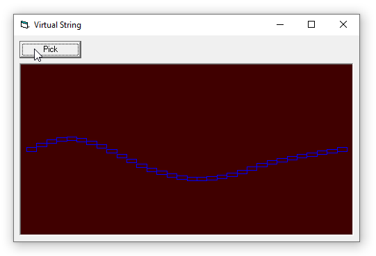

# Sound_VirtualString
## Virtual guitar string vibrating like a real string
Posted the project in physics-forum of ActiveVB on 29.may 2007 answering a question
from user "TheAy" about the simulation of a vibrating string.
Searching the internet for "physical modelling" I found the project "MassSpring" from 
Christoph Stüber, and ported it to VB.
Later on I implemented sound, for being able to also hear the string. 
But someday a harddisk quit life, so I lost the project.
fortunately I posted it in ActiveVB so at the end I was able to recreate the project.
at least the main part of it.

You can still find MassSpring of Christoph Stüber here:
https://www2.ak.tu-berlin.de/~fhein/Alias/Studio/Referate/physmodel/index.html

 
